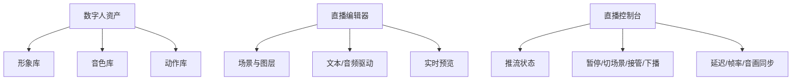
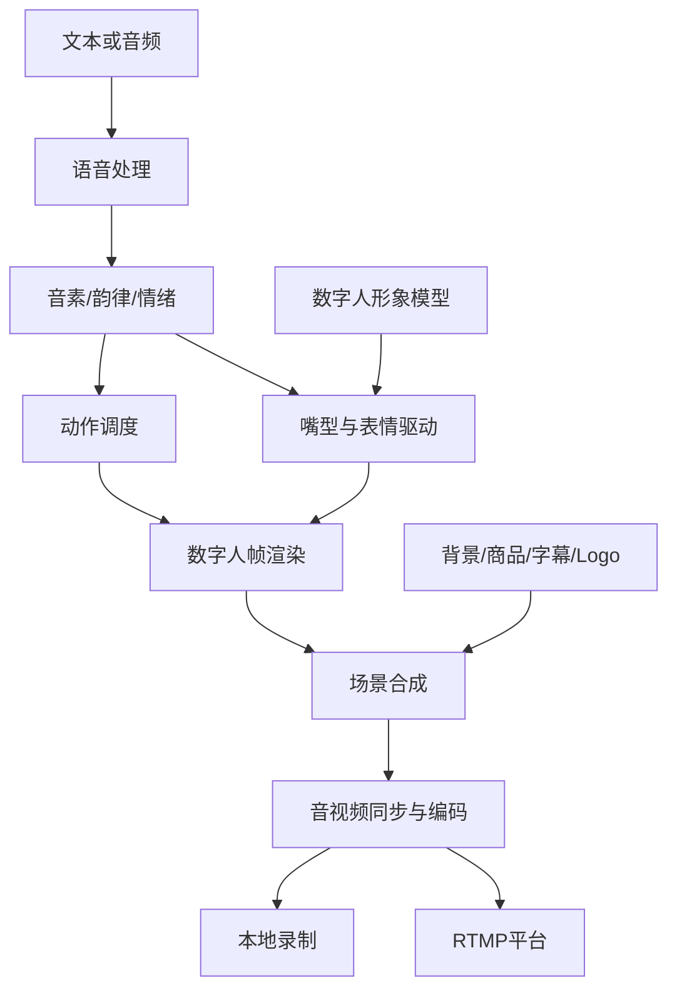

# 电商直播数字人：10 款代表性产品深度竞品调研报告

> **本版只研究“数字人本身”**：形象、声音、嘴型、表情、动作、实时驱动、直播场景、商品展示、推流和长时间稳定性。  
> 报告范围限定为数字人的生成、驱动、呈现与直播技术。  
> 调研时间：2026 年 9 月 15 日。  
> 调研对象：百度一镜（原慧播星）、京东云言犀、相芯科技 FaceUnity、硅基智能、跳悦智能、DeepBrain AI、商汤如影 SenseAvatar、美团智播、华为云 MetaStudio、小冰数字员工直播平台。

---

## 0. 先说结论

电商直播数字人已经不只是“让一张照片开口说话”。当前产品主要在竞争六件事：

1. **像不像**：脸部细节、皮肤质感、口型准确度、眼神和表情是否自然。
2. **动得自然不自然**：动作是否符合说话内容，长时间直播会不会反复做同一组手势。
3. **声音像不像真人**：音色还原、语气、停顿、重音、情绪和多音字是否自然。
4. **能不能展示商品**：能否持物、换品、插入商品特写、切换近景和远景。
5. **能不能长时间稳定直播**：是否出现画面漂移、口型错位、动作卡顿、推流中断和音画不同步。
6. **能不能快速制作和复用**：采集一次形象、声音和动作后，是否可以快速换文案、换商品、换场景、换语言。

因此，我们自己的产品不应该一开始就追求“做出全行业最像真人的数字人”，而应该先做：

> **一款面向电商直播的稳定型数字人：形象自然、声音清楚、口型准确、动作不机械，能展示商品和切换场景，并能连续稳定推流。**

第一阶段先把一个数字人播稳；第二阶段再做真人克隆、声音克隆和更丰富的动作；第三阶段再做双数字人、大姿态、持物和多语言。第三阶段不是终点，后续仍需持续优化真实度、延迟、长时稳定性和制作成本。

---

## 1. 行业现状

### 1.1 数字人从“播报员”进入“直播主播”阶段

早期数字人大多是半身正面形象，输入文字后按固定动作播报。这种方案适合新闻、培训和企业介绍，但放进电商直播间后会暴露出明显问题：动作重复、眼神发直、语气平、不会展示商品，观众看几分钟就会察觉机械感。

现在领先产品正在向更完整的直播形态发展：

- 从单一正面半身，发展到侧身、走动、大幅手势和全身动作；
- 从通用 TTS，发展到真人音色克隆、情绪语音和直播式语气；
- 从嘴部同步，发展到眼神、眉毛、面部肌肉和身体动作协同；
- 从固定背景，发展到实景复刻、商品特写、多镜头和动态直播间；
- 从短视频生成，发展到实时渲染、长时间直播和真人接管；
- 从一个数字人单独说话，发展到主播与助播两个数字人配合。

### 1.2 市场足够大，但对低质量数字人的容忍度在下降

《中国直播电商发展报告（2026）》显示，直播电商已经进入精细化发展阶段。数字人能够减少真人主播的重复工作，补充深夜、清晨等低效时段，但如果只是循环录播，很难产生长期价值。

另一方面，2026 年 2 月 1 日起施行的《直播电商监督管理办法》已将数字人主播等人工智能生成内容纳入监管。直播画面需要持续提示内容由 AI 生成，直播间运营者仍然承担责任。因此，数字人的画面标识、授权管理、内容可控和紧急停播必须从第一版考虑。

参考：[《中国直播电商发展报告（2026）》发布信息](https://cmi.sufe.edu.cn/)、[人民日报：数字人主播等生成内容被纳入监管](https://paper.people.com.cn/rmrb/pc/content/202602/02/content_30137481.html)

### 1.3 数字人的三条主流技术路线

| 路线 | 典型产品 | 优点 | 缺点 | 更适合什么场景 |
|---|---|---|---|---|
| 2D 拟真人/真人克隆 | 百度一镜、京东言犀、硅基智能、商汤如影、美团智播、小冰 | 真人感强，制作速度快，适合品牌和企业家分身 | 大侧脸、转身、持物和大动作较难；训练素材质量影响明显 | 标准电商讲品、品牌店播、真人分身 |
| 3D 虚拟人 | 相芯科技 | 动作自由、可全身驱动、形象可塑性强 | 建模成本高，拟真人质感与真人克隆仍有差距 | 二次元、虚拟 IP、娱乐化直播 |
| 实时交互型数字人 | DeepBrain AI、华为 MetaStudio 等 | 可实时接收文字或语音驱动，适合直播 | 实时渲染成本高，对延迟和稳定性要求高 | 直播、客服、导购、互动屏 |

实际产品往往是混合路线。例如相芯既有 3D 虚拟主播，也有拟真人直播；华为既有预制文本驱动，也支持即兴直播和真人接管。

---

## 2. 为什么要调研

这次调研要解决的不是“市场上有多少数字人公司”，而是四个直接影响我们产品方案的问题：

1. **第一版选哪种数字人路线？** 2D 拟真人、真人克隆还是 3D 虚拟人，成本和效果差别很大。
2. **什么才算能用于直播？** 能生成 30 秒口播视频，不等于能连续直播两小时。
3. **哪些能力最影响观看体验？** 不是分辨率越高越好，嘴型、眼神、动作重复度、语音节奏和商品展示往往更重要。
4. **我们应该自研到什么程度？** 是先接成熟数字人模型完成产品，还是从底层训练形象、声音和动作模型。

如果不先回答这四个问题，很容易做出一个短 Demo 看着不错、但无法真正直播的产品。

---

## 3. 市场主要方向

| 方向 | 代表产品 | 为什么有价值 | 对我们的启发 |
|---|---|---|---|
| 高拟真人分身 | 百度一镜、京东言犀、硅基智能 | 可以复用企业家、达人或主播的形象与声音 | 第二阶段再做专属克隆，第一阶段先用公版形象验证直播稳定性 |
| 往期直播复刻 | 商汤如影 | 不必重新拍绿幕素材，可以复用过去优秀直播画面 | 后续可支持从历史直播提取人物、场景和商品特写 |
| 双数字人 | 相芯科技、百度一镜 | 主播与助播轮流说话，画面和节奏更丰富 | 可先做双音色，再升级为双形象 |
| 大姿态与持物 | 京东言犀、华为 MetaStudio 等 | 让数字人更像真实带货主播，而不是新闻播报员 | 电商数字人必须为商品展示设计动作，不应只有通用手势 |
| 实景直播间 | 商汤如影、美团智播 | 商家可以保持自己的门店或品牌视觉 | 支持图片/视频背景和模板，再逐步做光照与人物融合 |
| 商品特写与镜头切换 | 商汤如影、华为 MetaStudio | 观众需要看清商品细节，不能一直看主播脸 | MVP 就应该支持商品图片、视频和贴图插入 |
| 情绪语音与直播式音色 | 百度、京东、华为、DeepBrain AI | 同一句促销话术需要有重音、停顿和兴奋感 | TTS 选择要看“直播听感”，不能只看音色相似度 |
| 云端矩阵直播 | 华为、硅基、相芯、小冰 | 多个直播间复用同一套数字人资产 | 第三阶段再做，第一阶段先保证一个直播间稳定 |
| 多语言数字人 | DeepBrain AI、小冰、硅基、华为 | 同一形象可服务跨境直播 | 先解决中文口型和声音，再扩多语言 |

---

## 4. 10 款代表性竞品与直播视频

### 4.1 视频核验标准

- **A 类：真实商业直播实录或录像片段**——主体是数字人正在讲品、带货或互动。
- **B 类：官方直播 Demo/客户案例**——能看到数字人直播效果，但夹有产品介绍或后台操作。
- **C 类：官方产品或操作演示**——能证明数字人能力和制作流程，不能当作纯直播录像。
- 视频链接可能受平台登录、地区、下架和风控影响，正式汇报前建议再点开检查一次。

### 4.2 竞品总表

| # | 产品 | 数字人路线 | 官网/产品页 | 演示视频或案例入口 | 视频说明 |
|---|---|---|---|---|---|
| 1 | 百度一镜（原慧播星） | 2D 高拟真人、真人分身、双数字人 | [官网](https://yijing.baidu.com/) / [产品页](https://cloud.baidu.com/product/huiboxing-api.html) | [罗永浩数字人直播片段](https://www.bilibili.com/video/BV1RMMizwEaH/) | **A 类**；真实商业直播录像片段，主体为数字人带货画面 |
| 2 | 京东云言犀 | 2D 高拟真人、大姿态数字人 | [言犀官网](https://jdai.jd.com/) / [官方技术介绍](https://developer.jdcloud.com/article/3089) | [“采销东哥”数字人直播片段](https://www.bilibili.com/video/BV1AH4y1K7Fi/) | **A 类**；实际京东直播间画面；可结合[央广网案例](https://tech.cnr.cn/techph/20240424/t20240424_526681897.shtml)核对 |
| 3 | 相芯科技 FaceUnity | 3D 虚拟主播、拟真人、双数字人 | [官网](https://www.faceunity.com/) | [相芯虚拟主播“小玉”直播花絮](https://www.bilibili.com/video/BV1ni4y137Mt/) | **A/B 类**；官方账号发布，主体是虚拟主播直播画面，偏 3D/动捕路线 |
| 4 | 硅基智能 | 2D 真人克隆、声音克隆 | [官方动态](https://blog.guiji.cn/) / [联合方案](https://www.huaweicloud.com/solution/silicon-intelligence-digital-human.html) | [硅基数字人直播效果](https://www.bilibili.com/video/BV1Nb4y1373e/) | **A 类短片**；主要是数字人直播效果，但视频较短且发布者身份不如官方链接清晰 |
| 5 | 跳悦智能 | 2D 拟真人、形象与声音克隆 | [官网](https://www.tiaoyuezhineng.com/) | [官网企业动态/演示入口](https://www.tiaoyuezhineng.com/news/) | **C 类**；能确认数字人和直播产品，本轮未找到稳定、可复核的纯实播独立视频直链 |
| 6 | DeepBrain AI | AI Human、实时拟真人、多语言 | [官网](https://www.deepbrain.io/) | [AI Showhost Live Shopping](https://www.youtube.com/watch?v=jBf2sFjGKFI) | **A/B 类**；官方视频，展示 AI 主播在 Naver Shopping Live 中进行购物直播 |
| 7 | 商汤如影 SenseAvatar | 2D 高拟真人、往期直播复刻 | [官网](https://senseavatar.sensetime.com/) / [产品页](https://www.sensetime.com/cn/product-detail?categoryId=51134279&gioNav=1) | [数字人超级直播间 Demo](https://www.bilibili.com/video/BV1igL4zsEr9/) | **B 类**；能看到数字人直播间效果，不等于完整商业直播录像 |
| 8 | 美团智播 | 行业数字人、真人 1:1 复刻、门店实景 | [官网](https://digihuman.meituan.com/) | [官方技术实践（含演示素材）](https://tech.meituan.com/2026/09/03/meituan-Digital-Human-practice.html) | **B/C 类**；官方页面有数字人直播效果素材，未找到独立纯实播长视频 |
| 9 | 华为云 MetaStudio | 分身数字人、实时互动、文本/音频驱动 | [产品页](https://www.huaweicloud.com/product/mdh.html) | [官方视频中心：徐福记/贵州电商云案例](https://support.huaweicloud.com/metastudio_video/index.html) | **B/C 类**；官方客户案例和操作视频，可信度高，但不是纯直播全程录像 |
| 10 | 小冰数字员工直播平台 | 数字孪生、直播数字员工、多语言 | [直播产品页](https://xiaoice.cn/live) | [官方产品入口](https://xiaoice.cn/live) / [数字孪生主播案例说明](https://www.qbitai.com/2021/12/31181.html) | **C 类**；可确认产品和数字人直播流程，未找到符合严格标准的独立纯实播长视频 |

> 后四家加入研究，是因为数字人制作、场景或企业级直播能力有参考价值。报告不会把宣传片、新闻采访或后台教程冒充成纯直播实录。

---

## 5. 每个竞品的数字人能力拆解

## 5.1 百度一镜：高拟真人 IP 分身与双数字人

**它解决的问题**：头部主播本人无法长时间直播，但其形象、声音和动作风格具有商业价值。百度一镜通过真人分身延长 IP 在线时间，并用双数字人减少单人独白的机械感。

**公开能力**：真人形象与声音复刻、表情嘴型和动作合成、双数字人同场、多模态直播间装修、图片换品讲解。来源：[官网](https://yijing.baidu.com/)、[产品页](https://cloud.baidu.com/product/huiboxing-api.html)。

**优点**：有大型真实直播案例；真人分身完整度较高；双人画面更有节奏。

**缺点**：高质量克隆对采集和训练要求高；头部定制效果不等于普通套餐；肖像和声音授权要求高。

**对我们的启发**：第一阶段预留主播与助播两条声音/动作轨道，第二阶段再升级成双形象。

## 5.2 京东云言犀：大姿态、直播式语音和真人分身

**它解决的问题**：传统 2D 数字人动作幅度小，像新闻播报员。言犀的大姿态路线让数字人更接近真人带货主播。

**公开能力**：小时级生成专属形象、声音和动作；韵律增强语音；人体外观重建；大姿态动作；语音、表情和身体姿势协同。来源：[言犀官网](https://jdai.jd.com/)、[京东云技术介绍](https://developer.jdcloud.com/article/3089)。

**优点**：“采销东哥”是实际直播案例；动作幅度和语音韵律更贴近电商直播。

**缺点**：大动作在手部、衣服边缘和快速姿态处更容易出现瑕疵；公开片段不足以评估数小时稳定性。

**对我们的启发**：动作库应按电商语义设计，例如介绍尺寸、强调价格、指向商品、欢迎、促单和转场，而不是只做随机挥手。

## 5.3 相芯科技 FaceUnity：3D 虚拟主播与双数字人

**它解决的问题**：2D 真人克隆动作自由度有限，3D 数字人可以转身、全身运动，也适合打造品牌虚拟 IP。

**公开能力**：3D 虚拟形象、实时表情与身体动捕、双数字人、拟真人直播、云端直播。来源：[相芯官网](https://www.faceunity.com/)、[“小玉”直播视频](https://www.bilibili.com/video/BV1ni4y137Mt/)。

**优点**：动作空间大；虚拟形象不必伪装真人；双数字人表现更丰富。

**缺点**：高品质 3D 建模和动作资产成本高；部分品类的消费者更信任真人风格；实时动捕仍需真人驱动。

**对我们的启发**：通用电商 MVP 优先 2D 拟真人；潮玩、动漫、游戏等客户再提供独立 3D 方案。

## 5.4 硅基智能：形象克隆、声音克隆与资产复用

**它解决的问题**：采集一次人物和声音，之后可用于直播、短视频和多个终端，减少反复拍摄。

**公开能力**：真人形象与声音克隆、多语种、数字人视频和直播、SDK、场景配置与推流。来源：[官方动态](https://blog.guiji.cn/)、[联合方案](https://www.huaweicloud.com/solution/silicon-intelligence-digital-human.html)。

**优点**：形象和声音可复用；开发生态有参考价值；产品线较完整。

**缺点**：公开信息较分散；短视频样本不能证明长时间动作与画面稳定；快速克隆不代表侧脸和大动作同样稳定。

**对我们的启发**：把形象、音色、动作和场景做成独立资产，支持自由组合、版本管理和授权到期。

## 5.5 跳悦智能：低门槛真人克隆与公版形象

**它解决的问题**：中小商家无法承担复杂拍摄和建模，需要少量素材快速生成可用数字人。

**公开能力**：200+ 公版形象；视频训练专属分身；10～60 秒声音克隆；多语言音色；文本/音频驱动；自定义背景、画幅与字幕。来源：[跳悦官网](https://www.tiaoyuezhineng.com/)、[官方 FAQ](https://www.tiaoyuezhineng.com/all_faq/)。

**优点**：门槛低；公版与专属形象并存；横竖屏复用方便。

**缺点**：旧直播案例链接稳定性一般；少样本克隆对素材质量敏感；公版人物过多复用会同质化。

**对我们的启发**：第一阶段不追求几百个形象，只提供少量经过长时测试、动作自然且适用品类清楚的公版主播。

## 5.6 DeepBrain AI：海外实时 AI Human 与多语言

**它解决的问题**：同一个品牌形象需要用不同语言直播，同时保持嘴型、表情和声音自然。

**公开能力**：高拟真 AI Human、实时视频与语音合成、自定义 Avatar、多语言、SDK、视频内容生产。来源：[官网](https://www.deepbrain.io/)、[官方 Live Shopping 视频](https://www.youtube.com/watch?v=jBf2sFjGKFI)。

**优点**：海外和多语言产品成熟；实时与视频形象可复用；直播案例链路清晰。

**缺点**：购物直播视频较早；不同语言要重新适配嘴型和动作；国内网络和平台适配需另测。

**对我们的启发**：语言、音色、口型模型和动作节奏应解耦。多语言不是只换字幕。

## 5.7 商汤如影 SenseAvatar：复刻真人直播间与商品特写

**它解决的问题**：成熟商家已有优质真人直播，但传统数字人要重新拍绿幕、重新搭场景。商汤路线是复用往期直播素材。

**公开能力**：高清直播感数字人、基于往期视频复刻直播间、商品特写、景别切换、多语种音色、对侧脸与人物出入画的优化。来源：[如影官网](https://senseavatar.sensetime.com/)、[商汤产品页](https://www.sensetime.com/cn/product-detail?categoryId=51134279&gioNav=1)。

**优点**：复用历史直播；商品特写更符合电商观看需求；减少重新寄样拍摄。

**缺点**：没有优质历史素材的新商家难发挥；复杂遮挡和旧素材会影响复刻；真人素材需明确授权。

**对我们的启发**：第二或第三阶段支持历史直播导入，由用户选择优质片段，提取背景、景别、动作和商品特写。

## 5.8 美团智播：行业形象、真人复刻与门店实景

**它解决的问题**：本地商家没有影棚，需要在门店实景中快速生成符合行业风格的数字人。

**公开能力**：行业数字人、真人 1:1 复刻、门店实景定制、快速生成直播素材、自然语音和长时间上播。来源：[美团智播官网](https://digihuman.meituan.com/)、[官方技术实践](https://tech.meituan.com/2026/09/03/meituan-Digital-Human-practice.html)。

**优点**：场景贴近门店；形象和模板适合中小商家；开播配置快。

**缺点**：模板化容易让不同门店相似；复杂门店光照和背景对融合要求高；公开页面缺独立纯实播长视频。

**对我们的启发**：MVP 支持门店图片或视频背景，并提供人物位置、阴影、色温和图层调整。

## 5.9 华为云 MetaStudio：完整的数字人制作与推流流程

**它解决的问题**：真正直播不仅要形象和声音，还要场景合成、文本/音频驱动、推流、暂停和真人接管。

**公开能力**：分身形象制作；多等级声音制作；走动、侧身、持物和实景训练；眼神矫正；文本、音频和即兴驱动；主播/助播音色；图层合成；RTMP 推流；真人接管和异常告警。来源：[产品页](https://www.huaweicloud.com/product/mdh.html)、[快速入门](https://support.huaweicloud.com/qs-metastudio/metastudio_03_0004.html)、[视频中心](https://support.huaweicloud.com/metastudio_video/index.html)。

**产品流程**：形象 → 声音 → 背景/贴图/视频 → 文本/音频驱动 → 预览 → RTMP 开播 → 暂停/接管/停止。

**优点**：流程完整；明确支持走动、侧身、持物与眼神矫正；直播控制能力强。

**缺点**：功能和参数多；企业云资源与计费对小商家不够直观；不同形象和声音支持范围需逐项确认。

**对我们的启发**：直接参考“形象资产—声音资产—场景编辑—驱动方式—预览—推流—接管”的产品骨架，但简化界面。

## 5.10 小冰数字员工直播平台：数字孪生与快速场景搭建

**它解决的问题**：把人物、声音、背景和直播视觉快速组合，降低数字人从制作到直播的配置成本。

**公开能力**：真人数字孪生；形象、声音、表情和动作生成；直播视觉搭建；多平台直播；多语言；长时间播报。来源：[直播产品页](https://xiaoice.cn/live)、[小冰官网](https://www.xiaoice.cn/)、[数字孪生主播案例](https://www.qbitai.com/2021/12/31181.html)。

**优点**：数字人和场景组合效率高；资产可在直播和视频中复用；多平台与多语言扩展性好。

**缺点**：公开技术参数和套餐差异不够详细；缺少符合严格标准的独立纯电商长直播视频。

**对我们的启发**：按品类提供推荐组合，例如食品、3C、服装和本地门店，自动搭配合适服装、音色、动作与背景。

---

## 6. 竞品差异对比

> ● = 官方资料明确支持；○ = 部分支持或需商务确认；— = 未找到可靠公开证据。该表不等于采购测试结果。

| 产品 | 真人复刻 | 声音克隆 | 3D | 大姿态/走动 | 双数字人 | 持物/特写 | 实景 | 多语言 | 真人接管 | 主要特色 |
|---|---:|---:|---:|---:|---:|---:|---:|---:|---:|---|
| 百度一镜 | ● | ● | ○ | ● | ● | ● | ● | ○ | ● | IP 分身、双数字人 |
| 京东言犀 | ● | ● | ○ | ● | ○ | ● | ● | ○ | ○ | 大姿态、直播式表达 |
| 相芯科技 | ○ | ○ | ● | ● | ● | ○ | ● | ○ | ○ | 3D、动捕、双数字人 |
| 硅基智能 | ● | ● | ○ | ○ | ○ | ○ | ● | ● | ○ | 快速克隆、资产复用 |
| 跳悦智能 | ● | ● | — | ○ | — | ○ | ● | ● | ○ | 低门槛克隆、公版形象 |
| DeepBrain AI | ● | ● | ● | ○ | ○ | ○ | ● | ● | ○ | 海外实时 AI Human |
| 商汤如影 | ● | ● | ○ | ● | ○ | ● | ● | ● | ○ | 往期直播复刻、特写 |
| 美团智播 | ● | ● | ○ | ○ | ○ | ● | ● | ○ | ● | 行业形象、门店实景 |
| 华为 MetaStudio | ● | ● | ● | ● | ○ | ● | ● | ● | ● | 完整制作、合成、推流 |
| 小冰 | ● | ● | ○ | ○ | ○ | ○ | ● | ● | ○ | 数字孪生、快速搭建 |

**观看体验优先级建议**：声音自然度 > 嘴型与眼神 > 动作重复度 > 商品展示 > 场景融合 > 单纯分辨率。4K 数字人如果眼神和动作机械，体验仍然差；稳定自然的 1080P 数字人往往更适合直播。

---

## 7. 当前市场还缺什么

1. **缺长时间公开实播**：几十秒最佳片段看不出动作重复、口型漂移、卡顿和断流。
2. **缺自然持物**：拿起、旋转、指向并放回商品时，手指、遮挡和商品边缘仍是难点。
3. **缺稳定侧脸和出入画**：转身、低头、遮挡、走出画面比正面半身难很多。
4. **缺真正有情绪的直播语音**：很多产品只做到音色像，没有做到热情、强调、停顿和重音像真人。
5. **缺又快又好的克隆**：少素材与高质量、低成本与长时稳定之间仍难兼得。
6. **缺清晰的授权与防滥用**：本人核验、授权期限、撤销、水印和追溯尚未成为普遍标准功能。
7. **缺复杂实景融合**：人物色温、阴影、景深和遮挡不一致时容易出现“贴图感”。

---

---

## 10. MVP 功能设计

### 10.1 用户流程

1. 创建直播数字人项目。
2. 选择一名公版主播。
3. 选择音色、语速、音量和停顿。
4. 选择竖屏或横屏模板。
5. 上传背景、商品图片/视频、Logo。
6. 输入文本或上传音频，预览嘴型和动作。
7. 设置字幕、动作轮换和 AI 标识。
8. 填写 RTMP 地址，完成 3 分钟试播。
9. 通过画质、音画同步和网络检查后正式开播。
10. 直播中暂停、恢复、插播、切场景或下播。

### 10.2 页面结构

### 10.3 MVP 页面清单

- **形象库**：性别、年龄感、服装、适用品类、半身/全身、动作范围、15 秒说话预览。
- **音色库**：试听、语速、音量、音高、停顿、多音字和数字读法。
- **动作库**：待机、呼吸、眨眼、欢迎、介绍、强调、指向、结束；配置冷却时间。
- **场景编辑器**：背景、人物、商品图/视频、价格贴图、Logo、字幕、图层、横竖屏安全区和 AI 标识。
- **实时预览**：测试文案、嘴型、动作、人物边缘、分辨率、帧率和 30 秒测试录制。
- **直播控制台**：画面、波形、码率、帧率、丢帧、延迟、插播、暂停、接管、下播和重连。

### 10.4 MVP 明确不包含

暂不做双数字人、真人克隆、全身持物、多平台矩阵和全语种。MVP 只负责把一个数字人稳定地生成和推流。

---

## 11. 纯数字人技术架构

### 11.1 模块说明

1. **形象资产层**：公版形象、真人克隆、面部关键点、骨骼、服装、发型、授权与版本。
2. **语音层**：TTS、上传音频、后续声音克隆，以及音素、停顿、重音和情绪提取。
3. **面部驱动层**：音素到嘴型，牙齿、下巴、脸颊、眨眼、眼神、眉毛和微表情。
4. **动作层**：待机动作、语句类型匹配、动作混合、过渡和冷却，后续扩展动捕、大姿态和持物。
5. **场景合成层**：背景、数字人、商品、字幕、Logo、AI 标识、图层、遮挡、缩放、色温和阴影。
6. **编码推流层**：720P/1080P、H.264/H.265、音视频时间戳、RTMP、断线重连、录制和监控。

### 11.2 实现策略

第一阶段可以接入成熟数字人渲染与 TTS，重点自建资产管理、动作编排、场景编辑、实时合成、推流控制和质量监控。接口标准化，避免绑定单一供应商；等延迟、成本或效果成为瓶颈后，再替换为自研或本地模型。

### 11.3 长时间稳定机制

- 音频和视频使用统一主时钟并定期校时；
- 帧率下降时优先保证音频连续，允许画面平滑降帧；
- 动作使用状态机和过渡动画，避免突然切断；
- 每个动作设置冷却时间和轮换权重；
- 推流进程与渲染进程解耦；
- 保留低码率预览和本地录制；
- 监控 GPU、内存、帧率、音画差和网络状态。

---

## 12. 数字人评测方案

| 维度 | 指标 | 测试方法 |
|---|---|---|
| 形象 | 身份稳定、皮肤、头发、牙齿、边缘 | 正面、侧脸、转头、快速动作逐帧检查 |
| 嘴型 | 音素准确、闭口、爆破音、延迟 | 统一中文测试稿和高速录屏 |
| 眼神 | 注视稳定、眨眼自然、是否发直 | 连续观看 10 分钟统计异常 |
| 表情 | 匹配语气、无突变 | 平静、热情、强调三类文本对比 |
| 动作 | 语义匹配、重复率、过渡 | 连续播 30 分钟统计动作频次 |
| 声音 | 音色、情绪、停顿、多音字、单位 | 统一直播话术盲听评分 |
| 商品展示 | 贴图、特写、持物、遮挡 | 测试小件、反光和复杂外形商品 |
| 场景 | 光照、阴影、色温、景深、边缘 | 三种门店背景对比 |
| 性能 | 首帧、帧率、延迟、GPU 成本 | 统一硬件和分辨率压测 |
| 稳定 | 漂移、卡顿、断流、音画差 | 2 小时、4 小时、8 小时阶梯测试 |

标准测试稿应包含价格数字、英文型号、多音字、快慢语速、强调停顿，以及指向、尺寸、欢迎等动作句；并准备 10 分钟长文本观察口型和动作漂移。

---

## 13. 风险与应对

| 风险 | 后果 | 应对 |
|---|---|---|
| 形象/声音未授权 | 侵权和冒用 | 本人核验、用途、期限、撤销和审计 |
| AI 标识缺失 | 违反监管或平台要求 | 画面常驻且不可误删的 AI 标识 |
| 嘴型与音频错位 | 用户迅速察觉机械感 | 统一时钟、延迟校准、口型测试 |
| 动作重复 | 停留下降 | 动作冷却、语义匹配、长时去重 |
| 手部/持物异常 | 商品展示不可信 | MVP 先用商品特写，成熟后再持物 |
| 侧脸/遮挡破损 | 画面穿帮 | 初期限制动作范围，逐步扩大训练 |
| 推流中断 | 直播停止 | 心跳、告警、重连和备用画面 |
| 云渲染成本高 | 毛利下降 | 分辨率分级、按需 GPU、低流量降帧 |
| 公版形象同质化 | 品牌辨识度低 | 精选形象、服装和场景差异化 |

---

## 14. 最终结论

百度和京东代表高拟真人、大姿态和 IP 分身；相芯代表 3D、动捕和双数字人；硅基与跳悦代表低门槛克隆和资产复用；DeepBrain AI 代表海外实时数字人和多语言；商汤代表往期直播复刻与商品特写；美团代表行业形象和门店实景；华为代表完整的制作、合成、推流和接管；小冰代表数字孪生和快速场景搭建。

我们的第一步不应该和大厂比“谁克隆得最像”，而应该先把基本体验做可靠：**声音自然、嘴型准确、眼神不呆、动作不重复、能展示商品、长时间不漂移、推流异常可控制。** 单数字人稳定后，再增加专属分身、情绪表达和实景；最后做双数字人、大姿态、持物、多语言和矩阵直播。

---

## 15. 适合给领导/老师讲的口语化汇报稿

各位老师、领导，这次我们调研了 10 款国内外电商直播数字人产品。本报告只看数字人本身，重点比较人物形象、声音、嘴型、表情动作、商品展示、直播场景、实时推流和长时间稳定性。

调研后可以把市场分成几条路线。百度一镜和京东言犀主要做高拟真人和企业家分身，优势是形象像真人、声音还原高，京东还展示了更大的身体动作。相芯更偏 3D 虚拟主播和双数字人。商汤如影最值得看的是复刻过去的真人直播间和商品特写，美团智播适合看门店实景和行业数字人。华为 MetaStudio 的流程最完整，从形象、声音、场景、文字或音频驱动，一直到推流、暂停和真人接管。DeepBrain AI、小冰和硅基则在多语言、数字孪生和资产复用方面更有代表性。

评价直播数字人不能只看几十秒 Demo，也不能只看分辨率。真正影响体验的是声音有没有直播感、嘴型准不准、眼神是否自然、动作会不会重复、能不能展示商品，以及连续两到八小时是否稳定。手部持物、侧脸、转身、遮挡、情绪语音和实景光照融合，仍是市场没有完全解决的难点。

因此第一阶段先做稳定单数字人：少量公版形象和音色，支持文字与音频驱动、基础嘴型和动作、商品图和视频、横竖屏、1080P 合成、RTMP 推流、暂停和下播，并完成两小时测试。第二阶段加真人形象和声音克隆、眼神矫正、情绪语音、多景别和门店实景。第三阶段再做双数字人、大姿态、持物、多语言、4K 和多直播间。第三阶段不是终点，后续还要长期优化真实度、延迟、动作重复、GPU 成本和授权安全。

最核心的一句话是：**我们不先做最复杂的数字人，而是先做一个真正能长时间稳定直播、观众看着不机械、商家能够控制的电商直播数字人。**

---

## 16. 5 句话总结

1. 电商直播数字人的核心是形象、声音、嘴型、动作、商品展示和长时间稳定性，不只是让照片开口。
2. 2D 拟真人适合通用电商，3D 虚拟人适合品牌 IP 和娱乐化直播。
3. 声音自然度、眼神、动作重复度和商品特写，通常比分辨率更影响体验。
4. 我们应先做稳定的单数字人 MVP，再增加真人克隆、双数字人、大姿态、持物和多语言。
5. 第三阶段不是终点，真实度、延迟、稳定性、成本、授权和平台合规需要持续优化。

---

## 17. 不建议做什么，最建议做什么

### 不建议

1. 第一阶段从零自研全部底层模型。
2. 只做“一张照片开口说话”，却不验证长时间直播。
3. 第一阶段就做双数字人、3D 全身和复杂持物。
4. 把 4K 当第一优先级，忽略声音、嘴型、眼神和稳定性。
5. 用几十秒最佳 Demo 判断产品好坏。
6. 忽略肖像和声音授权。

### 最建议

> **先做“稳定型单数字人直播平台”：精选公版形象和音色，做好中文嘴型、自然动作、商品素材叠加、横竖屏场景、1080P 实时合成、RTMP 推流、暂停接管和两小时稳定性。**

第一版成功标准是：**观众连续看 10 分钟不觉得明显机械，系统连续播 2 小时不漂移、不乱口型、不掉流，商家能随时控制。**

---

## 18. 主要资料来源

- [百度一镜](https://yijing.baidu.com/)｜[直播片段](https://www.bilibili.com/video/BV1RMMizwEaH/)
- [京东言犀](https://jdai.jd.com/)｜[直播片段](https://www.bilibili.com/video/BV1AH4y1K7Fi/)
- [相芯科技](https://www.faceunity.com/)｜[“小玉”直播](https://www.bilibili.com/video/BV1ni4y137Mt/)
- [硅基智能](https://blog.guiji.cn/)｜[直播短片](https://www.bilibili.com/video/BV1Nb4y1373e/)
- [跳悦智能](https://www.tiaoyuezhineng.com/)
- [DeepBrain AI](https://www.deepbrain.io/)｜[Live Shopping](https://www.youtube.com/watch?v=jBf2sFjGKFI)
- [商汤如影](https://senseavatar.sensetime.com/)｜[超级直播间 Demo](https://www.bilibili.com/video/BV1igL4zsEr9/)
- [美团智播](https://digihuman.meituan.com/)｜[官方技术实践](https://tech.meituan.com/2026/09/03/meituan-Digital-Human-practice.html)
- [华为 MetaStudio](https://www.huaweicloud.com/product/mdh.html)｜[官方视频中心](https://support.huaweicloud.com/metastudio_video/index.html)
- [小冰数字员工直播](https://xiaoice.cn/live)
- [人民日报：数字人主播纳入监管](https://paper.people.com.cn/rmrb/pc/content/202602/02/content_30137481.html)

> 正式选型前，应用统一文案、声音、背景、分辨率和硬件，对候选产品进行 2 小时、4 小时和 8 小时阶梯测试。
