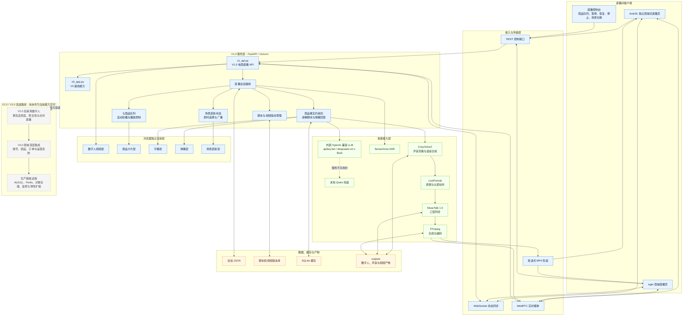

# 电商直播数字人系统架构图

> 本图以当前已部署的 V1.0 实现为准；V2.0/V3.0 内容单独列为演进路线，避免与现有能力混淆。

## 架构说明

- 当前系统由 `v0_app.py` 提供基础能力，`v1_api.py` 提供 V1.0 电商直播接口与会话编排。
- 商品卡片、字幕、弹幕、数字人视频和场景皮肤在浏览器中独立分层，因此切换场景只更新展示状态，不需要重新生成数字人视频。
- 主播讲解和弹幕回答受商品事实约束；外部大模型不可用时由本地 Qwen 兜底。
- 实时播放优先使用 WebRTC，并保留渐进式 MP4 作为兼容与故障兜底。
- V2.0/V3.0 以及 MySQL、Redis、对象存储等生产化基础设施属于后续建设路线。

