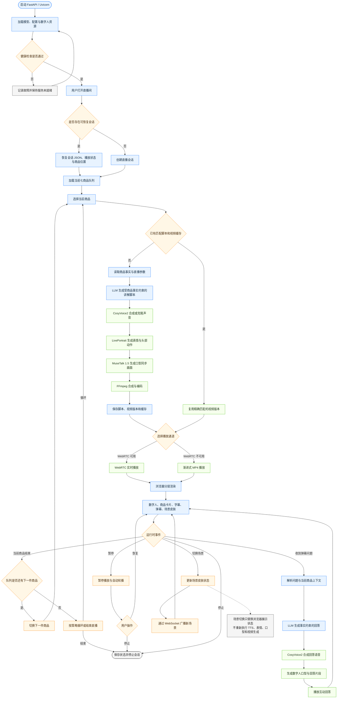

# 电商直播数字人运行时流程图

> 本图描述当前 V1.0 从启动、商品讲解到互动问答和场景切换的运行路径。

## 流程说明

- 服务启动后先完成模型与资源加载，健康检查通过后才对直播间提供服务。
- 会话优先恢复原有播放状态；新会话使用当前配置的七商品队列。
- 每件商品先查询精确匹配缓存。缓存未命中时才执行脚本、语音、表情、口型与视频合成流水线。
- WebRTC 是实时播放主通道，渐进式 MP4 用作兜底通道。
- 暂停会同时停止播放和商品自动轮播；恢复后从当前状态继续。
- 场景切换通过 WebSocket 更新浏览器的独立皮肤层，因此可以快速完成，也不会使现有商品视频失效。
- 弹幕问答使用当前商品上下文生成回答，播放回答片段后返回主讲解流程。

